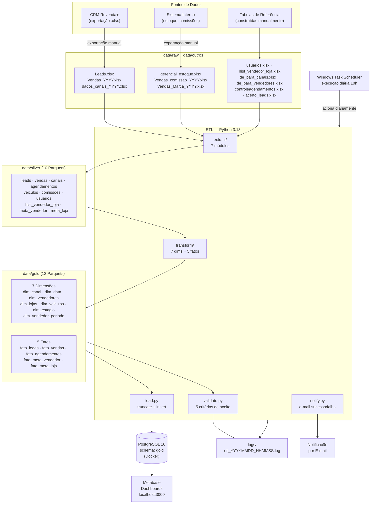

# CRM Analytics — Pipeline ETL para Concessionária

Pipeline de dados automatizado para uma rede de concessionárias de veículos. Lê exportações do CRM (Revenda+), aplica transformações em modelo estrela e carrega em PostgreSQL para análise no Metabase.

---

## Arquitetura e Ferramentas



### Tecnologias utilizadas

| Camada | Ferramenta | Versão |
|---|---|---|
| Linguagem | Python | 3.13 |
| Manipulação de dados | pandas | 3.0 |
| Formato intermediário | Apache Parquet | via pandas/pyarrow |
| Banco de dados | PostgreSQL | 16 |
| ORM / conexão | SQLAlchemy + psycopg2 | 2.0 / 2.9 |
| Visualização | Metabase | latest |
| Contêinerização | Docker Desktop | — |
| Agendamento | Windows Task Scheduler | — |
| IDE | VS Code | — |

---

## Estrutura de Diretórios

```
CRM_Analytics/
├── data/
│   ├── raw/                        ← Exportações do CRM e arquivos de referência
│   │   ├── Leads.xlsx
│   │   ├── Vendas_2022.xlsx … Vendas_2026.xlsx
│   │   ├── dados_canais_2022.xlsx … dados_canais_2026.xlsx
│   │   ├── controleagendamentos.xlsx
│   │   ├── gerencial_estoque.xlsx
│   │   ├── usuarios.xlsx
│   │   ├── hist_vendedor_loja.xlsx
│   │   ├── meta_vendedor.xlsx
│   │   ├── meta_loja.xlsx
│   │   ├── Lojas.xlsx
│   │   ├── de_para_canais.xlsx
│   │   └── de_para_vendedores.xlsx
│   ├── outros/                     ← Arquivos complementares
│   │   ├── gerencial_estoque_marca.xlsx
│   │   ├── Vendas_Marca_2022.xlsx … Vendas_Marca_2026.xlsx
│   │   ├── Vendas_comissao_2022.xlsx … Vendas_comissao_2026.xlsx
│   │   └── acerto_leads.xlsx
│   ├── silver/                     ← Parquets intermediários (10 arquivos)
│   └── gold/                       ← Parquets finais consumidos pelo Metabase (12 arquivos)
├── etl/
│   ├── run.py                      ← Orquestrador principal do pipeline
│   ├── config.py                   ← Constantes de caminhos e credenciais
│   ├── load.py                     ← Carga no PostgreSQL (truncate + insert)
│   ├── validate.py                 ← Relatório de qualidade pós-carga
│   ├── notify.py                   ← Notificações por e-mail
│   ├── utils.py                    ← Utilitários compartilhados
│   ├── extract/                    ← 7 módulos de extração (um por entidade)
│   │   ├── dimensoes_base.py
│   │   ├── leads.py
│   │   ├── vendas.py
│   │   ├── canais.py
│   │   ├── agendamentos.py
│   │   ├── veiculos.py
│   │   └── comissoes.py
│   └── transform/                  ← Transformações puras (sem I/O)
│       ├── dim_canal.py
│       ├── dim_data.py
│       ├── dim_lojas.py
│       ├── dim_veiculos.py
│       ├── dim_vendedores.py
│       ├── fato_agendamentos.py
│       ├── fato_leads.py
│       ├── fato_vendas.py
│       └── fato_metas.py
├── scheduler/
│   ├── run_etl.ps1                 ← Wrapper PowerShell para o agendador
│   └── setup_task.ps1              ← Configura a tarefa no Windows Task Scheduler
├── logs/                           ← Logs de execução (rotação automática: 30 dias)
├── tests/
│   └── test_utils.py
├── .env                            ← Credenciais e configurações (não commitado)
├── requirements.txt
└── CLAUDE.md
```

---

## Pré-requisitos

- Python 3.11 ou superior
- Docker Desktop em execução
- Git

---

## Instalação

```powershell
# 1. Clonar o repositório
git clone https://github.com/<org>/CRM_Analytics.git
cd CRM_Analytics

# 2. Criar e ativar ambiente virtual
python -m venv .venv
.\.venv\Scripts\Activate.ps1

# 3. Instalar dependências
pip install -r requirements.txt

# 4. Configurar variáveis de ambiente
#    Copie o arquivo de exemplo e preencha com suas credenciais
Copy-Item scheduler\.env.example .env
# Edite .env com suas configurações

# 5. Subir os contêineres Docker
docker run -d --name crm-postgres `
  -e POSTGRES_DB=crm_analytics -e POSTGRES_USER=crm -e POSTGRES_PASSWORD=crm123 `
  -p 5432:5432 postgres:16

docker run -d --name crm-metabase -p 3000:3000 metabase/metabase:latest
```

---

## Como Executar

```powershell
# Ativar ambiente virtual (sempre antes de executar)
.\.venv\Scripts\Activate.ps1

# Executar o pipeline completo (extração + transformação + carga no PostgreSQL)
python -m etl.run

# Executar sem carregar no banco (útil para testes e validação local)
python -m etl.run --no-db

# Configurar agendamento automático (executa uma única vez para criar a tarefa)
.\scheduler\setup_task.ps1

# Rodar os testes unitários
pytest tests/
```

O Metabase estará disponível em **http://localhost:3000** após os contêineres subirem.

---

## Fases do Pipeline

### 1. Extract — Extração

Sete módulos leem os arquivos Excel, validam o schema obrigatório e salvam Parquets na camada silver. Toda normalização de texto (De/Para de canais e vendedores) é aplicada aqui, antes de qualquer join (Regra R3).

| Módulo | Fonte principal | Saída silver |
|---|---|---|
| `dimensoes_base.py` | usuarios, hist_vendedor_loja, metas, de/para | 5 parquets |
| `leads.py` | Leads.xlsx + acerto_leads.xlsx | leads.parquet |
| `vendas.py` | Vendas_2022.xlsx … Vendas_2026.xlsx | vendas.parquet |
| `canais.py` | dados_canais_2022.xlsx … 2026.xlsx | canais.parquet |
| `agendamentos.py` | controleagendamentos.xlsx | agendamentos.parquet |
| `veiculos.py` | gerencial_estoque.xlsx + arquivos de marca | veiculos.parquet |
| `comissoes.py` | Vendas_comissao_2022.xlsx … 2026.xlsx | comissoes.parquet |

**Correções de leads:** Se o arquivo `data/outros/acerto_leads.xlsx` existir, as linhas com `Id` correspondente são substituídas antes de qualquer processamento.

### 2. Transform — Transformação

Funções puras (sem I/O) constroem o modelo estrela a partir dos dados silver.

**Dimensões (7):**

| Tabela | Descrição |
|---|---|
| `dim_canal` | Canais de venda padronizados |
| `dim_data` | Calendário completo 2022–2027 com trimestre, semestre, dia útil |
| `dim_vendedores` | Cadastro de vendedores + sentinela id = -1 |
| `dim_lojas` | Cadastro de lojas + sentinela id = -1 |
| `dim_veiculos` | Veículos com marca, modelo, ano, cor, situação |
| `dim_estagio` | Estágios do funil de leads |
| `dim_vendedor_periodo` | Histórico vendedor × loja × mês (tabela de auditoria) |

**Fatos (5):**

| Tabela | Granularidade | Métricas principais |
|---|---|---|
| `fato_leads` | 1 linha por lead | convertido_flag, perdido_flag |
| `fato_vendas` | 1 linha por venda | valor_venda, valor_compra, comissao, lucro, retorno |
| `fato_agendamentos` | 1 linha por agendamento | flag_agendamento, flag_visita |
| `fato_meta_vendedor` | 1 linha por vendedor × mês | meta_qtd |
| `fato_meta_loja` | 1 linha por loja × mês | meta_qtd |

### 3. Load — Carga no PostgreSQL

Estratégia **truncate + insert**: cada execução apaga e recarrega todas as tabelas do schema `gold`. Adequado para o volume atual do dataset. Após a carga, uma verificação compara a contagem de linhas no Parquet com a do banco.

### 4. Validate — Validação de Qualidade

Cinco critérios de aceite executados a cada run:

| Critério | Limiar | O que verifica |
|---|---|---|
| Marca desconhecida | < 5% | Veículos ativos sem marca identificada |
| Cobertura de comissão | ≥ 90% | `fato_vendas` com valor de comissão preenchido |
| Cobertura do calendário | 2022–2027 | `dim_data` cobre o intervalo completo |
| Campos de calendário | 0 nulos | trimestre, semestre, dia_semana, dias_uteis_mes |
| Integridade do join de comissão | Sem perda de linhas | `fato_vendas` não perde linhas no join com comissoes (R6) |

O relatório de match rates também é exibido: percentual de registros com `id_vendedor = -1` ou `id_loja = -1` por fato.

### 5. Notify — Notificação por E-mail

Ao final de cada execução, um e-mail é enviado com o resumo dos critérios de aceite (sucesso) ou com o traceback do erro (falha). Requer configuração das variáveis `SMTP_*` no `.env`.

---

## Modelo Estrela — Camada Gold

Convenção de chaves estrangeiras:
- `id_data` (inteiro YYYYMMDD) → `dim_data.id_data`
- Todas as FKs de dimensão são inteiros; registros sem match recebem `id = -1`

```
dim_canal ──────────────────────────────────────────────────────┐
dim_data ────────────────────────────────────────────────────┐  │
dim_vendedores ────────────────────────────────────────────┐ │  │
dim_lojas ───────────────────────────────────────────────┐ │ │  │
dim_veiculos ─────────────────────────────────────────┐  │ │ │  │
dim_estagio ───────────────────────────────────────┐  │  │ │ │  │
                                                   │  │  │ │ │  │
fato_leads         ← id_estagio, id_data, id_vendedor, id_loja, id_canal
fato_vendas        ← id_veiculo, id_data, id_vendedor, id_loja, id_canal
fato_agendamentos  ← id_data_agendamento, id_data_visita, id_vendedor, id_loja, id_canal
fato_meta_vendedor ← id_vendedor, id_loja, id_data
fato_meta_loja     ← id_loja, id_data
```

---

## Tabelas de Referência

Estas tabelas foram construídas e mantidas manualmente pelo analista de dados para viabilizar o modelo. São a base do pipeline:

| Arquivo | Registros | Finalidade |
|---|---|---|
| `usuarios.xlsx` | 29 | Cadastro de vendedores com data de admissão, demissão e status |
| `hist_vendedor_loja.xlsx` | 31 | Histórico de qual loja cada vendedor pertencia em cada período (resolve R1) |
| `de_para_canais.xlsx` | 17 | Padronização de nomes de canais entre diferentes fontes |
| `de_para_vendedores.xlsx` | 27 | Padronização de grafias de nomes de vendedores |
| `controleagendamentos.xlsx` | 254 | Registro manual de agendamentos com resultado e responsável |
| `acerto_leads.xlsx` | variável | Correções pontuais de leads com dados incorretos no CRM |

---

## Regras de Negócio

| # | Regra | Implementação |
|---|---|---|
| **R1** | A loja do vendedor é resolvida pela data do evento, não pela loja atual | `utils.adicionar_vendedor_loja()` + `hist_vendedor_loja` |
| **R2** | Nenhuma linha é descartada por falta de match — sem match recebe `id = -1` | Todos os fatos: `fillna(-1)` após left join |
| **R3** | Mapeamentos De/Para são aplicados **antes** de qualquer join | Todos os módulos `extract/` |
| **R4** | `id_veiculo = Código` — chave consistente em todos os arquivos de vendas | `fato_vendas.py` e `dim_veiculos.py` |
| **R5** | `dim_vendedor_periodo` é tabela de auditoria — **não usar como bridge** no Metabase | Documentado; usar `dim_lojas` para cruzamentos |
| **R6** | Join de comissão em `fato_vendas` é sempre left join — nunca perde linhas | `fato_vendas.py` usa `.merge(..., how="left")` |
| **R7** | Enriquecimento de marca: estoque atual → histórico de vendas → "desconhecida" | `extract/veiculos.py` em três etapas |

---

## Configuração de Ambiente

Crie o arquivo `.env` na raiz do projeto com as seguintes variáveis:

```env
# PostgreSQL
PG_HOST=localhost
PG_PORT=5432
PG_DB=crm_analytics
PG_USER=crm
PG_PASS=crm123

# SMTP para notificações (exemplo Gmail)
SMTP_HOST=smtp.gmail.com
SMTP_PORT=587
SMTP_USER=seu_email@gmail.com
SMTP_PASS=sua_senha_de_aplicativo
NOTIFY_TO=destinatario@exemplo.com

# Encoding do terminal (necessário no Windows)
PYTHONIOENCODING=utf-8
```

---

## Agendamento Automático

O script `scheduler/run_etl.ps1` é executado diariamente às **10h** pelo Windows Task Scheduler. Ele:

1. Carrega as variáveis do `.env`
2. Inicia os contêineres Docker (`crm-postgres`, `crm-metabase`) se não estiverem em execução
3. Aguarda até 30 segundos o PostgreSQL aceitar conexões
4. Executa `python -m etl.run`
5. Grava o log completo em `logs/etl_YYYYMMDD_HHMMSS.log`
6. Remove logs com mais de 30 dias automaticamente

Para configurar a tarefa no Windows Task Scheduler pela primeira vez:

```powershell
# Execute uma vez como Administrador
.\scheduler\setup_task.ps1
```

---

## Logs e Monitoramento

Cada execução gera um arquivo de log em `logs/` com timestamp:

```
logs/
  etl_20260521_100003.log
  etl_20260520_100001.log
  ...
```

Logs mais antigos que 30 dias são removidos automaticamente pelo `run_etl.ps1`.

---

## Testes

```powershell
# Ativar venv e rodar os testes
.\.venv\Scripts\Activate.ps1
pytest tests/ -v
```

Os testes cobrem `normalizar_texto()` e as funções utilitárias em `etl/utils.py`.
